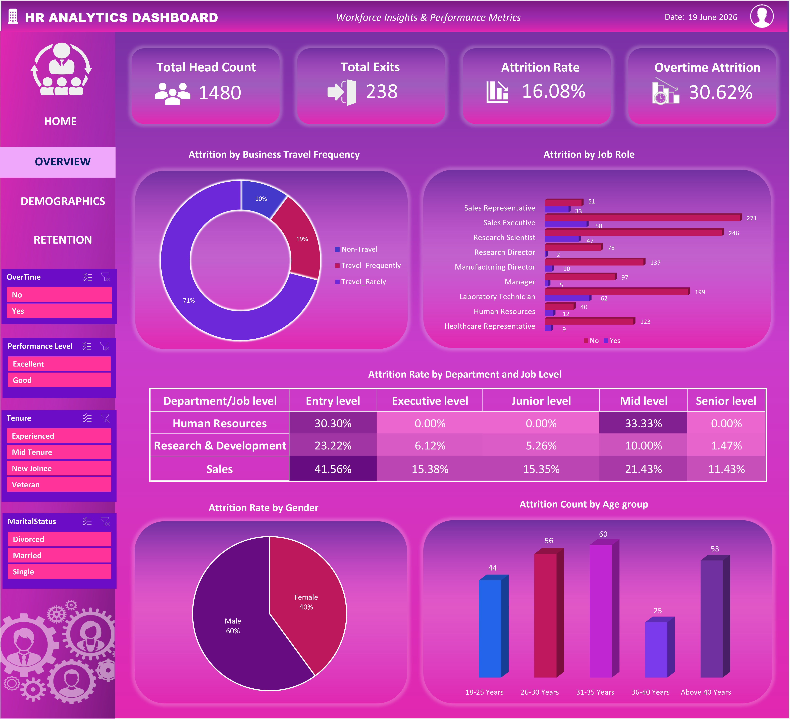
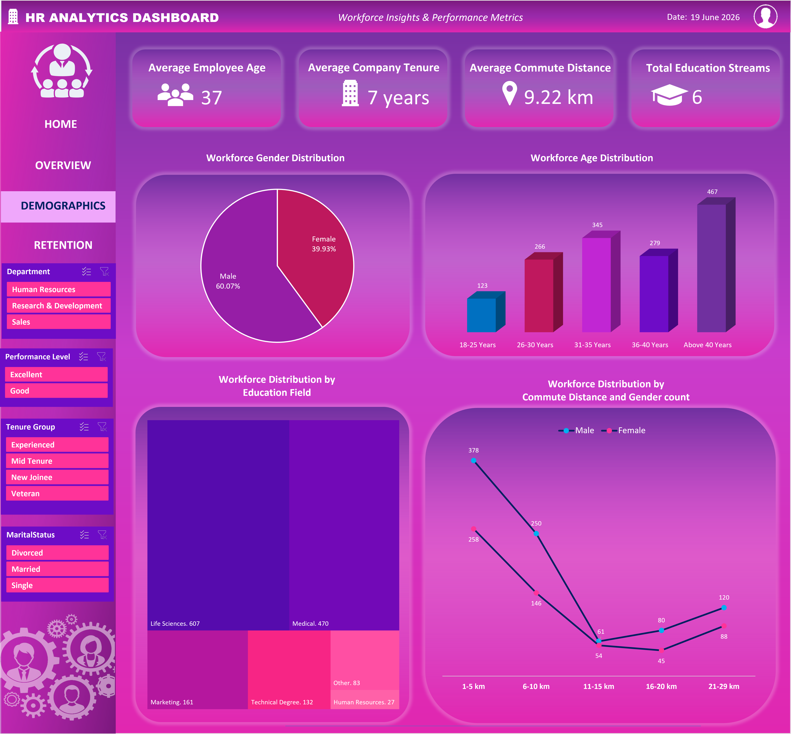
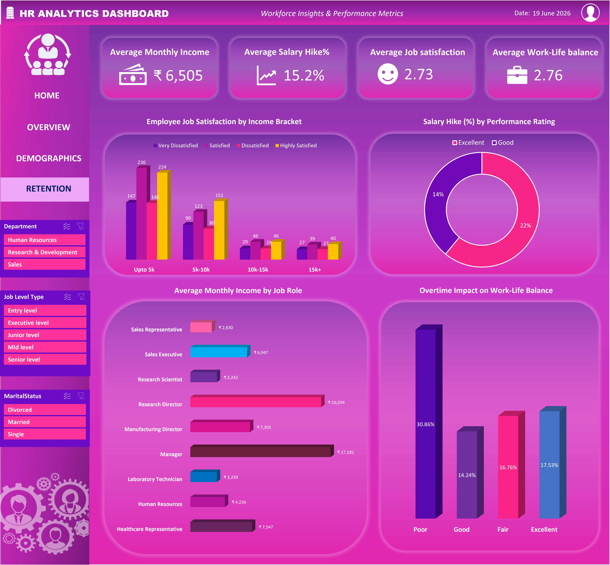

# HR-Analytics-Dashboard
This project is an interactive HR dashboard built to stop an expensive problem: a high number of employees quitting. Instead of looking at the company as a whole, the dashboard breaks down the data to show leadership exactly where and why people are leaving so they can fix it.

# 📸 Dashboard Preview

<h3>Home Page</h3>

<h3>Employee Attrition</h3>

<h3>Employee Demographics</h3>

<h3>Employee Retention</h3>

# 📌 Project Overview
This project presents an interactive HR Analytics Dashboard built in Microsoft Excel to analyze employee demographics, attrition trends, and workforce retention patterns. The dashboard transforms raw HR data into meaningful insights that help organizations understand employee behavior and make informed workforce decisions.

# 🎯 Business Problem
Employee attrition can lead to increased recruitment costs, loss of experienced talent and reduced organizational productivity. However, without proper analysis, HR teams often struggle to identify the departments, employee groups and workplace factors contributing to employee turnover.

This project aims to uncover the key drivers of attrition and provide actionable insights that support employee retention strategies.

# 🎯 Project Objectives
<ul>
  <li>Monitor overall workforce health and employee turnover.</li>
  <li>Identify departments and job roles with high attrition.</li>
  <li>Analyze employee demographics and workforce distribution.</li>
  <li>Understand the relationship between attrition and factors such as overtime, business travel, age and job level.</li>
  <li>Support data-driven HR decision-making through interactive visualizations.</li>
</ul>

# 🛠 Tools & Features Used
<ol>
  <li>Microsoft Excel</li>
  <li>Power Query</li>
  <li>Power Pivot and DAX</li>
  <li>Pivot Tables</li>
  <li>Pivot Charts</li>
  <li>Slicers</li>
  <li>Conditional Formatting</li>
  <li>Interactive Navigation Buttons</li>
  <li>Dashboard Design & Data Visualization</li>
</ol>

# 📊 Key Performance Indicators (KPIs)
<table>
  <h3>Employee Attrition </h3>
  <tr>
    <th>KPI</th>
    <th>Value</th>
  </tr>
  <tr>
    <td>Total Employees</td>
    <td>1480</td>
  </tr>
  <tr>
    <td>Attrition Count</td>
    <td>238</td>
  </tr>
   <tr>
    <td>Overall Attrition Rate</td>
    <td>16.08%</td>
  </tr>
  <tr>
    <td>Overtime Attrition Rate</td>
    <td>30.62%</td>
  </tr>
</table>

<table>
  <h3>Employee Demographics </h3>
  <tr>
    <th>KPI</th>
    <th>Value</th>
  </tr>
  <tr>
    <td>Average Employee Age</td>
    <td>37</td>
  </tr>
  <tr>
    <td>Average Company Tenure</td>
    <td>7 years</td>
  </tr>
   <tr>
    <td>Average Commute Distance</td>
    <td>9.22km</td>
  </tr>
  <tr>
    <td>Total Education Streams</td>
    <td>6</td>
  </tr>
</table>

<table>
  <h3>Employee Retention </h3>
  <tr>
    <th>KPI</th>
    <th>Value</th>
  </tr>
  <tr>
    <td>Average Monthly Income</td>
    <td>Rs. 6505</td>
  </tr>
  <tr>
    <td>Average Salary Hike%</td>
    <td>15.2%</td>
  </tr>
   <tr>
    <td>Average Job Satisfaction</td>
    <td>2.73</td>
  </tr>
  <tr>
    <td>Average Work-Life balance</td>
    <td>2.76</td>
  </tr>
</table>

# 📈 Dashboard Pages
**1. Home Dashboard**:
Provides a high-level overview of the project - objective, dataset details, tools used, hyperlinks to various pages and key business insights derived from the analysis.

**2. Attrition Overview**:
Analyzes attrition by:
- Department
- Job Level
- Job Role
- Business Travel
- Gender
- Age group etc. with different slicers

**3. Employee Demographics**:
Analyzes workforce composition based on:
- Gender
- Age Groups
- Education field
- Commute Distance

**4. Employee Retention**:
Examines factors influencing employee retention by:
- Job Satisfaction by Income bracket
- Salary Hike% based on performance
- Average monthly income by Job role
- Overtime impact on Work-life balance

# 🔍 Key Insights and Recommendations

<h4>1. Employee Attrition by Business Travel Frequency</h4>
  
🤔Problem: Employees who rarely get a chance to go for business travel and fall under "Travel-Rarely" category contribute to the highest share of employee attrition (71%).
 
  
💡Solution: Improving employee engagement, providing career growth opportunities and recognition programs may help reduce the turnover.

<h4>2. Employee Attrition by Job Role</h4>

🤔Problem:The highest number of employees leaving the organization are from the Laboratory Technician (62 employees) and Sales Executive (58 employees) roles. Additionally, Sales Representatives show a high attrition rate, with 33 out of 84 employees leaving the organization. 

💡Solution: Identify key causes of turover for these job roles and implement strategies that focus on improving retention through employee engangement and development programs.

<h4>3. Employee Attrition by Department and Job level</h4>

🤔Problem:Entry level employees belonging to Sales department faces the highest attrition rate (41.56%) followed by Entry level HR (30.30%) and Entry level R&D(23.22%). Heavy losses are observed for both entry level and mid level positions for HR department. Across all the 3 departments (HR,R&D,Sales), entry level positions are experiencing the highest turnover rates.

💡Solution: The organization should focus on improving retention among entry-level employees through better onboarding, training and career growth opportunities particularly for entry-level employees in the Sales and HR departments and identify key factors driving employee exits.

<h4>4. Employee Attrition by Gender</h4>

🤔Problem:Male employees  account for a higher share of attrition (60%) compared to female employees

💡Solution: Identify factors behind higher attrition among male employees and implement targeted retention strategies based on the findings.  

<h4>5. Employee Attrition by Age</h4>

🤔Problem: Employees aged 26–35 years and above 40 years account for the highest attrition rates compared to other age groups.

💡Solution: Identify factors influencing attrition within these age groups and implement targeted retention strategies like providing career growth opportunities, employee engagement initiatives and work-life balance support to help reduce the turnover.

<h4>1. Workforce Gender Distribution </h4>
  
🤔Problem: There is a notable gender diversity gap within the workforce, with male employees accounting for 60.07% of the workforce compared to 39.93% female employees.
 
  
💡Solution: Strengthen diversity and inclusion initiatives to support a more balanced workforce representation.

<h4>2. Workforce Age Distribution</h4>

🤔Problem:Employees aged above 40 years represent the largest age group in the workforce (467 employees), while the 18–25 years age group has the lowest representation (123 employees). This imbalance may create future workforce challenges.

💡Solution: Focus on attracting young talented people by ensuring effective knowledge transfer from experienced employees and implement strategies and programs to retain them for longer time. 

<h4>3. Workforce Distribution by Educational Field</h4>

🤔Problem:The workforce is heavily concentrated in Life Sciences (607 employees) and Medical (470 employees) fields, while employees from business, technical, and HR backgrounds are significantly underrepresented. 

💡Solution: Broaden recruitment efforts to attract talent from diverse educational backgrounds and strengthen workforce skill diversity.

<h4>4. Workforce Distribution by Commute distance and Gender count</h4>

🤔Problem:Although most employees, irrespective of gender live within 10km from workplace, a sudden spike is observed for few employees coming from 21-29km daily (208 employees). Long commuting distance can lead to employee fatigue, reduced work-life balance and increased turnover risk.

💡Solution: Provide flexible work arrangements, hybrid work options or transportation support to improve employee well-being and retention.  

<h4>1. Employee Job satisfaction by Income bracket </h4>
  
🤔Problem: Employees who fall under Income bracket of "Upto 5k" are unhappy with 147 - Very Dissatisfied and 146 - Dissatisfied
 
  
💡Solution: Identify causes of dissatisfaction and implement measures to improve employee satisfaction and engagement.  
  
<h4>2. Salary Hike % received based on performance</h4>

 Employees with both "Excellent" and "Good" performance rating are getting good salary hikes. We need to ensure that performance results are communicated with all the employees as achievable milestones to motivate the employees coming under low salary bracket to work harder.

<h4>3. Average monthly income by Job role</h4>

🤔Problem:Sales Representatives (₹2,630), Laboratory Technicians (₹3,239), and Research Scientists (₹3,242) receive significantly lower average salaries compared to managerial positions. 

💡Solution: Review compensation structures to ensure salaries remain competitive and aligned with employee responsibilities, skills and market standards.   

<h4>4. Overtime impact on Work-life balance</h4>

🤔Problem: Among employees affected by overtime work, 30.86% rate their work-life balance as Poor which is substantially higher than any other work-life balance category. 

💡Solution: Implement measures to reduce excessive overtime and support employee well-being to improve work-life balance and retention.  

 

✨Connect with me: <a href="https://www.linkedin.com/in/aiswarya-mohan-950948221/"> Linkedin </a>

